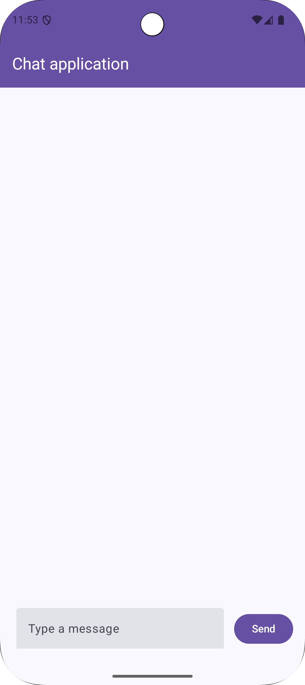

# Chatbot App 

## Application Overview

Chatbot App is a simple chat application where a user can type a message, send it, and see the sent
message appear in a list below. After a short delay, a response (simulating a reply) will also
appear in the chat list.

## Application Flow

1. **App Launch**: The `MainActivity` is the entry point of the application.
2. **Dependency Injection**: Koin is initialized in `MainActivity` to manage dependencies (like
   `ChatViewModel`, `MessageRepository`).
3. **UI Setup**:
    * `MainActivity` sets up the main UI using Jetpack Compose.
    * It displays a `Scaffold` with a `CustomTopBar`.
    * The main content area is occupied by `ChatScreen`.
4. **Chat Interaction**:
    * The `ChatScreen` is responsible for displaying the chat messages and the input field.
    * It observes data from `ChatViewModel`.
    * When the user types a message and clicks "Send":
        * The input text is sent to the `ChatViewModel`.
        * The `ChatViewModel` processes this event (likely by interacting with a
          `MessageRepository`).
        * The new message is added to the chat history, and the UI updates to show it.
        * The `ChatViewModel` (or `MessageRepository`) simulates a delay and then adds a response
          message to the chat history. The UI updates again to display this response.

## Code Structure

The application follows a standard Android MVVM (Model-View-ViewModel) architecture.

### Main Packages (`app/src/main/java/com/app/chatbot`)

* **`MainActivity.kt`**: The main entry point of the application. It sets up the basic UI structure
  and initializes dependency injection.
* **`di`**: Contains dependency injection setup using Koin (`appModule`). This package is
  responsible for providing instances of classes like ViewModels and Repositories.
* **`model`**: Defines the data structures used in the application. For a chat app, this would
  typically include a `Message` data class (e.g., `ChatMessage.kt` with properties like message
  text, sender, timestamp).
* **`repo`**: Contains repository classes (e.g., `MessageRepository.kt`). Repositories are
  responsible for handling data operations, such as fetching and storing messages. In this app, it
  would simulate sending a message and receiving a delayed response.
* **`viewmodel`**: Holds ViewModel classes (e.g., `ChatViewModel.kt`). ViewModels prepare and manage
  data for the UI. `ChatViewModel` would handle the logic for sending messages, managing the chat
  history, and interacting with the `MessageRepository`.
* **`ui`**: Contains UI-related code, further divided into:
    * **`screen`**: Composable functions representing different screens of the app (e.g.,
      `ChatScreen.kt`, `CustomTopBar.kt`). `ChatScreen.kt` would contain the UI for displaying
      messages, the text input field, and the send button.
    * **`theme`**: Defines the application's theme, including colors (`Color.kt`), typography (
      `Type.kt`), and the main theme file (`Theme.kt`).
* **`events`**: Likely contains sealed classes or interfaces to represent UI events or actions (
  e.g., `ChatEvent.SendMessage`).
* **`stateui`**: Likely contains classes to represent the UI state for different screens (e.g.,
  `ChatScreenUiState`).

### Test Cases

#### Unit Tests (`app/src/test/java/com/app/chatbot`)

Unit tests focus on testing individual components in isolation.

* **`viewmodel` (e.g., `ChatViewModelTest.kt`)**: Tests the logic within the `ChatViewModel`, such
  as:
    * Verifying that sending a message correctly updates the chat history.
    * Ensuring that the simulated response is received after a delay.
    * Testing different states of the ViewModel.
* **`repo` (e.g., `MessageRepositoryTest.kt`)**: Tests the logic within the `MessageRepository`,
  such as:
    * Verifying that messages are "sent" and "received" correctly (even if simulated).
* **`ExampleUnitTest.kt`**: An example unit test file provided by Android Studio.

#### Instrumented Tests (`app/src/androidTest/java/com/app/chatbot`)

Instrumented tests run on an Android device or emulator and are used for testing UI interactions and
Android framework components.

* **`ChatScreenTest.kt`**: *(This file might be a leftover or incorrectly named for a chat
  application. If it's intended for the chat app, it should be renamed, e.g., `ChatScreenTest.kt`)*.
  Assuming it's meant for `ChatScreen`:
    * Tests UI interactions on the `ChatScreen`.
    * Verifies that typing text into the input field and clicking "Send" displays the message on the
      screen.
    * Checks if the simulated response appears correctly.
    * Tests UI elements like the `CustomTopBar` are displayed.
* **`ExampleInstrumentedTest.kt`**: An example instrumented test file provided by Android Studio.

## UI Screens

The primary UI screen is the `ChatScreen`.

### `ChatScreen`

* **Purpose**: Displays the list of chat messages and provides an input field for the user to type
  and send new messages.
* **Components**:
    * A list view (e.g., `LazyColumn`) to display sent and received messages.
    * A text input field (e.g., `TextField`) for the user to type their message.
    * A "Send" button (e.g., `Button`) to submit the message.
* **Interactions**:
    * Users can type text into the input field.
    * Tapping the "Send" button sends the message.
    * The screen updates to show the new message and, after a delay, a response.

### `CustomTopBar`

* **Purpose**: Displays a custom top app bar, likely showing the application's title.

## Screenshots

*(Please add screenshots of the application here to visually illustrate the UI and flow. For
example:)*

* **Screenshot 1: Empty Chat Screen**
  *(Image of the chat screen when no messages have been sent yet)*
  

* **Screenshot 2: User Typing a Message**
  *(Image of the chat screen with text in the input field)*
  
*
* **Screenshot 3: Message Sent by User**
  *(Image of the chat screen after the user sends a message, showing the message in the chat list)*
  
*
* **Screenshot 4: Response Received**
  *(Image of the chat screen showing the simulated response below the user's message)*
  
